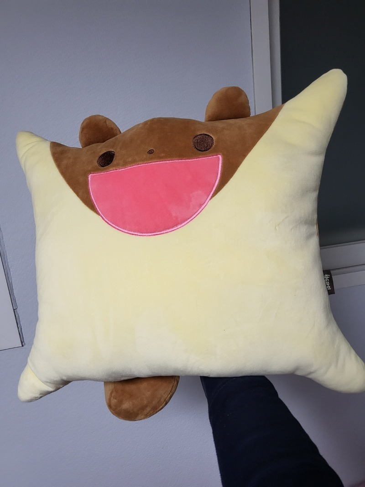

# 22/09/01

날짜: 2022년 9월 1일

## 진행 사항 🗓

### 전체

- 주제 결정
    - 언택트 마음챙김 서비스
- 서비스 이름 결정 → **Hugging**
- 기능 구체화 회의
- 아이디어 선정에 대한 팀 미팅 피드백
    - 컨설턴트님 → 명상 음악에 비쥬얼적인 요소 추가하라
    - 코치님 →

### 백엔드

- 백엔드 컨벤션 결정
    - 자바, DB, 엔티티와 dto

### 프론트엔드

- 기술 스택 결정 → React
- React Bootstrap, Prettier 사용하기로 결정

---

## TODO ✅

### 전체

- 깃 브랜치명 컨벤션 회의
- 피드백 반영하여 기능 구체화 회의
- 화면 설계

### 백엔드

- ERD 다이어그램 작성
- API 명세서 작성

 

### 프론트엔드

- 각자 React 강의 듣기
- Code Convention 정하기

---

## 오늘의 한마디 😎

### 유일권

창의력 고갈….

개발이 차라리 나은거같기도..

→ ci/cd 하셔야죠

→ 그건 젠킨스가 알아서 해주잖아요…

### 송예림

주제 선정은 항상 어려운 듯 😭

화이팅💪🏻

### 최주희

드디어 아이디어 선정

힘들었다…………..

다들 화이팅 합시다 ☺️

→ 화이팅…

### 김호진

과연 개발이 나을까요?

### 이주희

리액트 얼른 다 들어올게요ㅠㅠ

### 조성규

이래서 시작이 반이라고 하는 건가 봐요….

